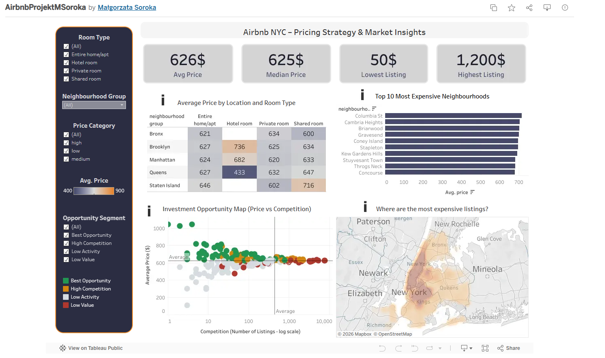

# Airbnb Pricing Analysis

## Project Overview
This project focuses on exploratory data analysis (EDA) of Airbnb listings data to identify the key factors influencing rental prices and market trends.

The analysis was performed using Python and Pandas, while Tableau was used to create interactive dashboards and visualizations supporting business insights and pricing optimization recommendations.

---

## Tools & Technologies
- Python
- Pandas
- Tableau
- Data Cleaning
- Exploratory Data Analysis (EDA)
- Data Visualization

---

## Project Objectives
- Identify factors affecting Airbnb rental prices
- Analyze room type and neighborhood trends
- Explore pricing distribution and market patterns
- Create interactive dashboards for business insights

---

## Key Activities
- Cleaned and transformed raw Airbnb datasets
- Performed exploratory data analysis using Python
- Analyzed pricing trends and neighborhood performance
- Created Tableau dashboards presenting operational insights

---

## Dashboard Preview

---

## Business Insights
- Entire apartments generated the highest average prices
- Certain neighborhoods combined high prices with relatively low competition
- Room type and location strongly influenced pricing trends

---

## Tableau Dashboard
(https://public.tableau.com/app/profile/ma.gorzata.soroka/viz/AirbnbProjektMSoroka/Dashboard2?publish=yes)
